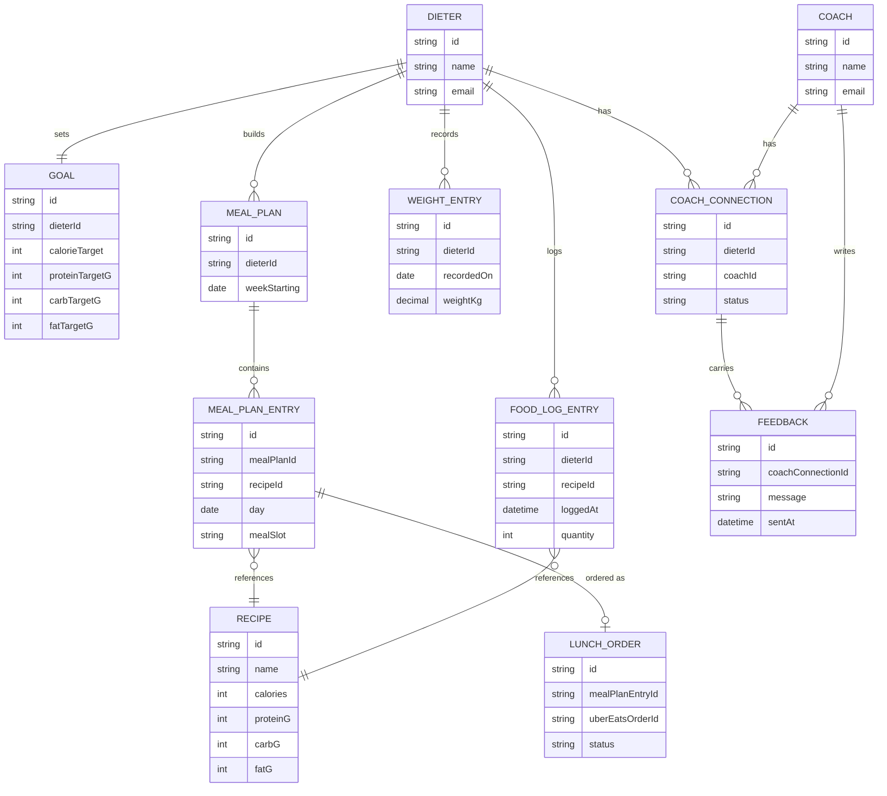

# Domain Model

The core entities behind meal planning, logging, progress tracking, and the
coach relationship.

A **Dieter** sets one active **Goal**, builds **MealPlan**s from the
**Recipe** catalog, and logs actual meals as **FoodLogEntry** rows. A
**WeightEntry** records progress over time. A **CoachConnection** links a
Dieter to a **Coach** (many-to-many); a Coach leaves **Feedback** on a
connection. A **MealPlanEntry** may be ordered through Uber Eats, recorded as
a **LunchOrder**.