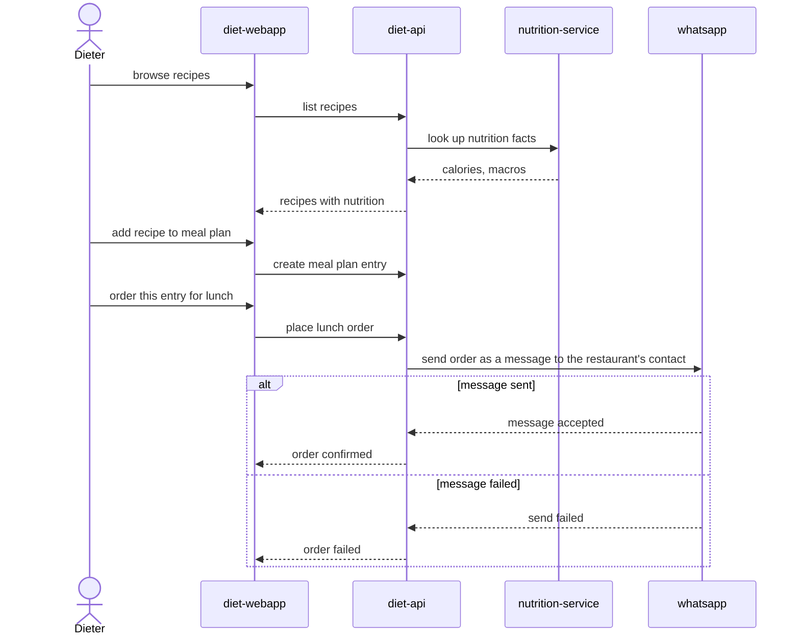

# Plan meals and order lunch

A Dieter builds a meal plan from the recipe catalog and orders a planned
lunch by having it sent as a WhatsApp message to the restaurant's contact.

```mermaid
sequenceDiagram
    actor Dieter
    participant diet-webapp
    participant diet-api
    participant nutrition-service
    participant whatsapp

    Dieter->>diet-webapp: browse recipes
    diet-webapp->>diet-api: list recipes
    diet-api->>nutrition-service: look up nutrition facts
    nutrition-service-->>diet-api: calories, macros
    diet-api-->>diet-webapp: recipes with nutrition
    Dieter->>diet-webapp: add recipe to meal plan
    diet-webapp->>diet-api: create meal plan entry
    Dieter->>diet-webapp: order this entry for lunch
    diet-webapp->>diet-api: place lunch order
    diet-api->>whatsapp: send order as a message to the restaurant's contact
    alt message sent
        whatsapp-->>diet-api: message accepted
        diet-api-->>diet-webapp: order confirmed
    else message failed
        whatsapp-->>diet-api: send failed
        diet-api-->>diet-webapp: order failed
    end
```

